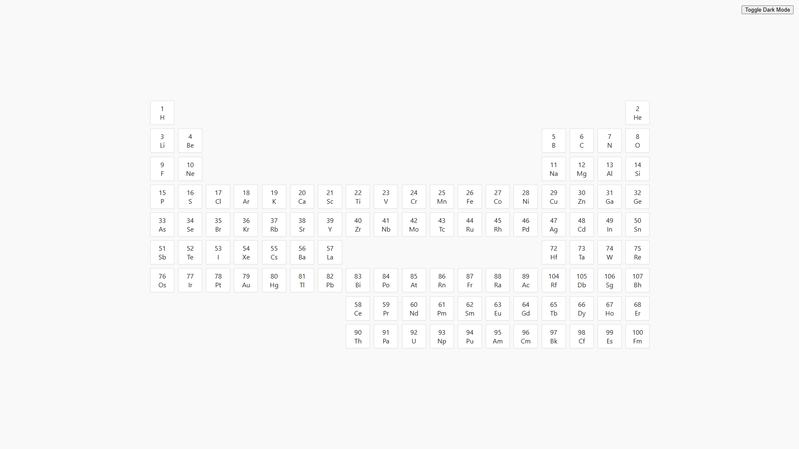
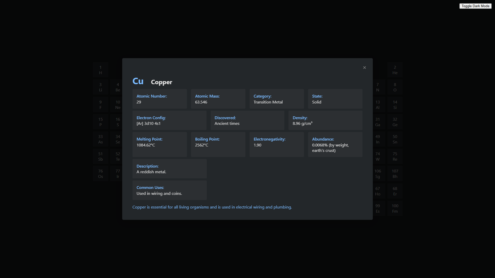
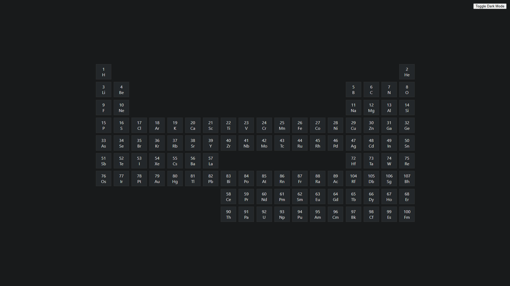

# Minimal Periodic Table – Project Blog

## What is this project?

This project is a minimal, interactive Periodic Table web application. It visually displays all chemical elements, and allows users to click on any element to view detailed information such as atomic number, mass, electron configuration, category, state, discovery, and more. The design is clean and includes a dark mode toggle for accessibility and user preference.



## Why did I build it?

I created this project to experiment with and test the capabilities of GitHub Copilot GPT-4.1, and to have some fun with web development. The project also serves as a showcase of my ability to build interactive, data-driven UIs from scratch, and to demonstrate my personal JavaScript utility library (`general.js`).

## Technologies and Tools Used

- **HTML5** for structure
- **CSS3** for styling (including dark mode)
- **Vanilla JavaScript** for all interactivity
- **Custom utility library** (`general.js`) for event handling, DOM utilities, and more
- **No frameworks or build tools** – everything is hand-written for maximum transparency

## Key Features & Code Examples

### 1. Dynamic Table Generation
The periodic table is generated dynamically from a data array, with each element rendered as a clickable cell:

```js
// ...existing code...
tableLayout.forEach((row, rowIndex) => {
  row.forEach((cell, colIndex) => {
    if (cell !== null && elements[cell]) {
      const el = elements[cell];
      const div = document.createElement('div');
      div.className = 'element';
      div.style.gridColumn = (colIndex + 1);
      div.style.gridRow = (rowIndex + 1);
      div.innerHTML = `<span class="element-number">${el.number}</span><span class="element-symbol">${el.symbol}</span>`;
      listener.add(div, 'click', () => {
        showModal(el);
      });
      table.appendChild(div);
    }
  });
});
// ...existing code...
```

### 2. Element Data Structure
All element data is stored in a structured array, making it easy to extend or update:

```js
const elements = [
  { number: 1, symbol: 'H', name: 'Hydrogen', desc: 'A colorless, odorless gas. The lightest element.', uses: 'Used in water, fuels, and as a lifting gas.',
    atomicMass: '1.008', electronConfig: '1s1', category: 'Nonmetal', state: 'Gas', discovered: '1766, Henry Cavendish', density: '0.00008988 g/cm³', meltingPoint: '-259.16°C', boilingPoint: '-252.87°C', electronegativity: '2.20', abundance: '1400 ppm (universe)', fact: 'Most abundant element in the universe.' },
  // ...more elements...
];
```

### 3. Modal Display for Element Details
Clicking an element opens a modal with all its properties, formatted for clarity:

```js
function showModal(el) {
  const header = `<div class="modal-header"><span class="modal-symbol">${el.symbol}</span><span class="modal-title">${el.name}</span></div>`;
  // ...build rows for properties...
  document.getElementById('element-desc').innerHTML = header + row1 + row2 + row3 + desc + uses + fact;
  document.getElementById('element-modal').classList.remove('hidden');
}
```



### 4. Dark Mode Toggle
A simple button toggles dark mode, with the preference saved in localStorage:

```js
listener.add(toggleBtn, 'click', () => {
  document.body.classList.toggle('dark-mode');
  localStorage.setItem('periodicTableDarkMode', document.body.classList.contains('dark-mode'));
});
```

### 5. My Personal Utility Library (`general.js`)
This project uses my own utility library, which I have developed and refined over the years. It includes helpers for event handling, DOM manipulation, and more. Example:

```js
const listener = {
  functions: {},
  add(arg1, arg2, arg3, arg4) {
    // ...event binding logic...
  },
  remove(name) {
    // ...event unbinding logic...
  }
};
```

## Styling Example
The CSS is modern and supports both light and dark themes:

```css
body {
  font-family: 'Segoe UI', Arial, sans-serif;
  background: #f9f9f9;
  color: #222;
  min-height: 100vh;
  display: flex;
  align-items: center;
  justify-content: center;
}

body.dark-mode {
  background: #181a1b;
  color: #e0e0e0;
}

.element {
  background: #fff;
  border: 1px solid #e0e0e0;
  border-radius: 0;
  display: flex;
  flex-direction: column;
  align-items: center;
  justify-content: center;
  cursor: pointer;
  transition: box-shadow 0.2s;
}
```



## What have I learned?

Building this project was a fun way to push the limits of GitHub Copilot GPT-4.1 and to see how much of a polished, interactive app I could create with just vanilla JavaScript and my own utility code. I deepened my understanding of dynamic DOM manipulation, modular code organization, and CSS for accessible design. I also enjoyed refining my personal library (`general.js`) and seeing it in action in a real-world UI.

If you’d like to know more about the project, feel free to reach out!
